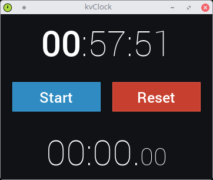

kvClock
=======

Simple clock app with Android look & feel

:alt: kvClock

Description
-----------

This toy app was developed with **Python 3** and `Kivi
libray <https://kivy.org/#home>`__ with a predominantly focus on the
desktop. However, it is entirely possible to use it on mobile devices,
for example through `Kivy
Launcher <https://play.google.com/store/apps/details?id=org.kivy.pygame&hl=en>`__
for Android.

License
-------

This project is under GLP3 license.
